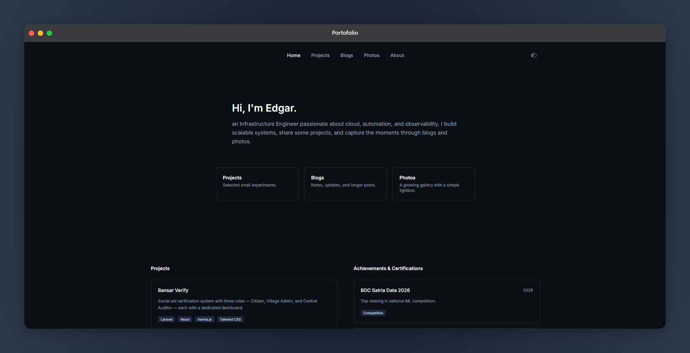

<div align="center">
  

  <br><br>
  <h4>Personal Portfolio Website</h4>
  
  <p><sub>A minimalist personal website built with vanilla web technologies to showcase projects, engineering writings, and photography.</sub></p>

  <p>
    <a href="https://portofolio.edgar.my.id"><sub><strong>View Live Demo »</strong></sub></a>
  </p>
</div>

---

**Highlights**

<sub>

* **Multi-Page Architecture:** Dedicated sections for Projects, Blogs, and a curated Photos gallery with a custom lightbox.
* **Responsive & Accessible:** Fluid layout designed for mobile, tablet, and desktop viewing.
* **Zero Heavy Frameworks:** Built purely with vanilla JavaScript, HTML, and CSS for fast load times and clean structure.

</sub>

**Built With**

<sub>

* **HTML5** — Semantic structure
* **CSS3** — Custom layout, responsive grid, and dark theme styling
* **Vanilla JavaScript** — Lightbox logic, interactions, and dynamic UI elements

</sub>

**📂 Project Structure**

```text
├── assets/
│   └── Portofolio.png     # Preview image assets
├── page/
│   ├── blogs.html         # Engineering notes & articles
│   ├── photos.html        # Gallery showcase with lightbox
│   └── project.html       # Projects showcase
├── .gitignore
├── index.html             # Landing & hero page
├── LICENSE                # MIT license
├── README.MD              # Documentation
├── script.js              # Vanilla interaction scripts
├── style.css              # Styling & layout definitions
└── vercel.json            # Deployment & clean URL configurations
